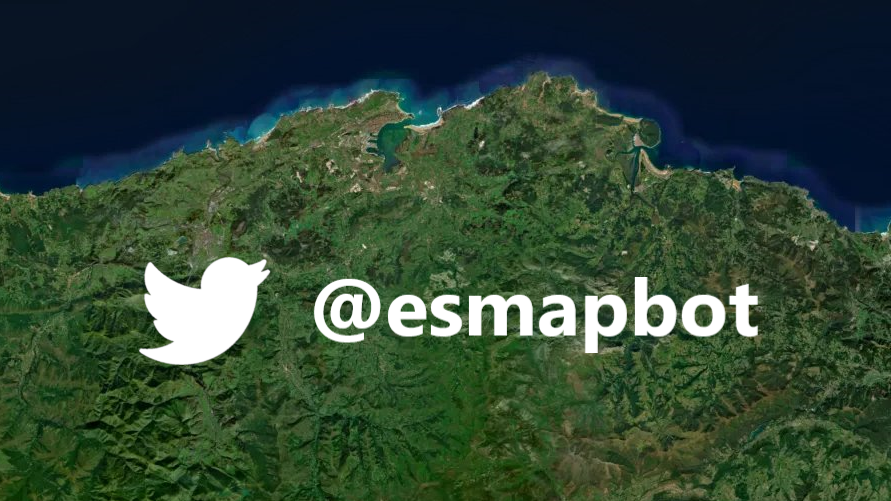

# España desde el cielo

### 🤖🛰️🇪🇦

Código fuente del bot de Twitter [@esmapbot](https://www.twitter.com/esmapbot) que postea cada seis horas una imagen de satélite aleatoria de España junto a sus coordenadas lat/lon WGS 84 🌐, su dirección 📍 y un enlace al lugar en Google Maps 🗺.

Construido originalmente por [@mattdray](https://twitter.com/mattdray), este bot es una adaptación de su [@londonmapbot](https://twitter.com/londonmapbot) hecha por Rober J ([@roberer_](https://www.twitter.com/roberer_)). 

Inicialmente, las coordenadas se generaban aleatoriamente entre los rangos delimitados por una bounding box de Londres. Aplicar este método a España daba lugar a que muchas veces las imágenes correspondieran al mar, a Francia o a Portugal, y al incorporar las islas resultaba aún más problemático.

En su lugar, este bot obtiene las coordenadas a partir de un punto generado aleatoriamente dentro de un polígono almacenado en un archivo geojson con las fronteras de España, para lo cual el paquete sf de R ha sido fundamental.

Para darle una vuelta de tuerca, he añadido dos nuevas funcionalidades. La primera es muy simple: añadir aleatoriedad al nivel de zoom con el que se obtienen las imágenes para que haya más variedad aún si cabe a la de la geografía española.

La segunda ha consistido en usar un servicio de geocoding (yo he usado mymappi porque es el más sencillo y barato que he encontrado en castellano) para transformar las coordenadas de ese punto generado aleatoriamente en una dirección legible (he estado tentado de usar la API de what3words…)

Por último, he cambiado el servicio de cartografía al que enlaza el bot para ver en un mapa el contexto geográfico de la imagen. Originalmente se compartía un enlace que te llevaba al lugar en OpenStreetMap, pero decidí cambiarlo a Google Maps porque desgraciadamente en OSM no hay vista de satélite. 

## Librerías 

* [{rtweet}](https://docs.ropensci.org/rtweet/)
* [Simple Features for R](https://github.com/r-spatial/sf/)
* [MapBox Static Images API](https://docs.mapbox.com/api/maps/static-images/)
* [mymappi Geocoding API](https://mymappi.com/es/geocoding/)
* [GitHub Actions](https://docs.github.com/en/actions) 

## Nuevas características
Modificaciones respecto al código del [repositorio original](https://github.com/matt-dray/londonmapbot):

* Las coordenadas se obtienen a partir de un punto generado aleatoriamente dentro de una capa geojson con las fronteras terrestres de España
* Se ha añadido aleatoriedad en el nivel de zoom con el que se realizan las peticiones de imágenes
* Ahora también comparte la dirección del lugar mediante la geocodificación inversa de las coordenadas. Se devuelve el mensaje "¿Adivinas?" en caso de que la API devuelva valor nulo
* El enlace ahora te lleva al lugar en Google Maps en vez de a OpenStreetMap
* Se ha modificado la resolución de las imágenes a 600 x 900 píxeles, adaptándolas así al formato vertical de los teléfonos móviles

## Sígueme!

_________________________________________________________________________________________________________________________________________________________________
_________________________________________________________________________________________________________________________________________________________________

# Spain from Sky

Source code of Twitter bot [@esmapbot](https://www.twitter.com/esmapbot) which posts every six hours a random satellite image of Spain accompanied by its lat/lon WGS 84 coordinates 🌐, its address 📍 and a link to that location in Google Maps 🗺.

By Rober J ([@roberer_](https://www.twitter.com/roberer_)) based on [@mattdray](https://twitter.com/mattdray)'s work with his [@londonmapbot](https://twitter.com/londonmapbot).

## Libraries

* [{rtweet}](https://docs.ropensci.org/rtweet/)
* [Simple Features for R](https://github.com/r-spatial/sf/)
* [MapBox Static Images API](https://docs.mapbox.com/api/maps/static-images/)
* [mymappi Geocoding API](https://mymappi.com/es/geocoding/)
* [GitHub Actions](https://docs.github.com/en/actions) 

## New features
Changes from source code at [original repo](https://github.com/matt-dray/londonmapbot):

* Coordinates are now taken from randomly generated points inside Spain's terrestrial boundary limits stored in a geojson file.
* Zoom level randomness was added to image requests
* Inverse geocoding of coordinates to get adresses. A predefined message substitute null values returned from the API.
* The location link now redirects to Google Maps instead of OpenStreetMap
* Image size request has been changed to 600 x 900 for a better mobile experience 

## Follow me!

